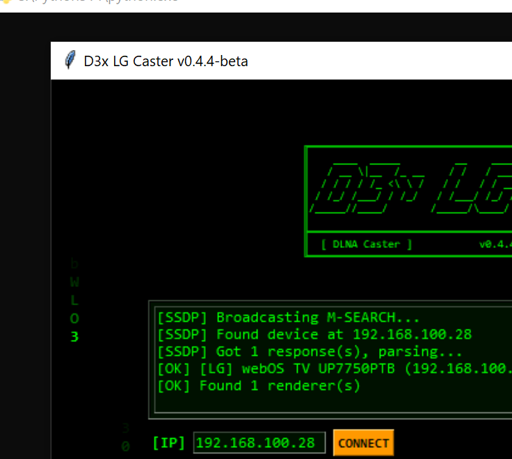
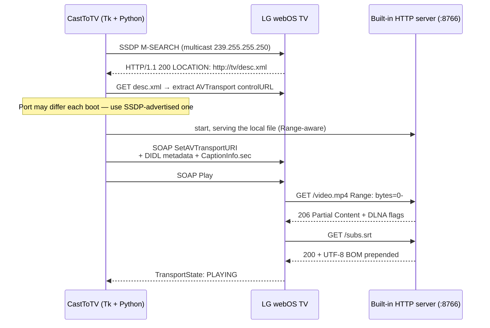
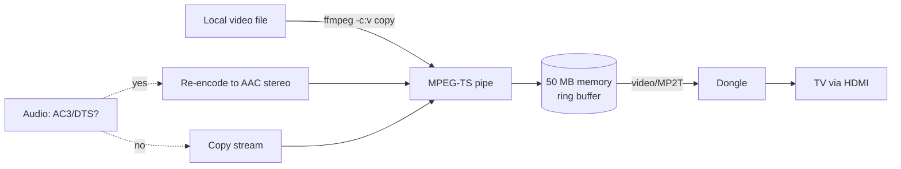

# CastToTV

```
╔═══════════════════════════════════════════════════════════╗
║    ____  _____         __    ______   ______          __  ║
║   / __ \|__  /_ __    / /   / ____/  /_  __/__  __   / /  ║
║  / / / / /_ <\ \ /   / /   / / __     / /  \ \ / /  / /   ║
║ / /_/ /___/ / /_/   / /___/ /_/ /    / /    \ V /  /_/    ║
║/_____//____/       /_____/\____/    /_/      \_/  (_)     ║
║                                                           ║
╠═══════════════════════════════════════════════════════════╣
║  [ DLNA Caster ]           v0.4.4-beta  *  D3x  *  2026  ║
╚═══════════════════════════════════════════════════════════╝
```

> A keygen-2005-styled DLNA caster for LG webOS TVs and generic WiFi
> cast dongles, with on-the-fly transcoding and external subtitles.
> Single-file Python, ~1200 LOC, no installation.

[](https://www.python.org/)
[]()
[](LICENSE)
[]()
[]()



---

## TL;DR

```bash
git clone https://github.com/mikhailartamonov/CastToTV.git && cd CastToTV
python cast_to_tv.py
# Click DISCOVER → click [...] → pick a video → click <<< CAST >>>
```

The TV starts playing within ~2 seconds. That is the entire workflow.

## Why this exists

Streaming a local file to an LG webOS TV looks like a solved problem
until you actually try. VLC's renderer support hangs on subtitles. Plex
needs a server. Kodi wants a remote. Web casts re-encode the entire
file. Chrome's Cast extension only speaks Google's protocol.

DLNA / UPnP works on every TV in the last 15 years, but the spec is a
maze and LG's implementation has three quirks no one writes down:

1. **The AVTransport port randomises after every reboot** — port `9197`
   one day, `41123` the next. So discovery has to happen every session.
2. **External subtitles need `CaptionInfo.sec` _plus_ `sec:CaptionInfoEx`**
   — both, in matching case, or the renderer ignores them.
3. **Subtitles must start with a UTF-8 BOM**, even though the spec
   doesn't require one. The decoder silently drops anything else.

CastToTV figures all three out automatically. The GUI is the kind of
thing you used to find on a warez floppy — and that's the point.

## How casting works



For WiFi cast dongles (Maxscreen / AnyCast / EZCast / ElfCast) the same
control plane is used, but the data plane switches to MPEG-TS in a 50 MB
ring buffer because dongles can't seek raw MP4:



## Features

- **Three discovery paths.** SSDP M-SEARCH (the polite way), ICMP sweep
  of the /24 (when the TV's UPnP stack is asleep), or just paste an IP.
- **DLNA port auto-detection** — fingerprints `<MediaRenderer>` +
  `<AVTransport>` in the device descriptor, so the random port LG hands
  out each boot stops being a problem.
- **Range-aware HTTP server** at port 8766 — seek bar in the GUI maps
  to `Range: bytes=N-` requests, no re-encoding.
- **External subtitles** — SRT, VTT, SUB, SMI. Delivered via
  `CaptionInfo.sec` HTTP header **and** `sec:CaptionInfoEx` DIDL-Lite
  metadata, with UTF-8 BOM auto-prepended.
- **On-the-fly audio transcode** — AC3 / EAC3 / DTS / TrueHD / MLP get
  re-encoded to AAC stereo via ffmpeg pipe; video is copied losslessly.
  Triggered automatically.
- **Dongle mode** — for WiFi cast sticks, MPEG-TS in a memory buffer,
  served as `video/MP2T` with `transferMode.dlna.org: Streaming`.
  Seeking by re-spawning ffmpeg with `-ss`.
- **One-click dongle WiFi reconfigure** — opens the dongle's setup web
  UI (`192.168.49.1`, `192.168.203.1`, `192.168.1.1`) when it forgets
  your network.
- **Debug logger** — `cast_log.txt` next to the script, gated by the
  `DEBUG_VERBOSE` flag, captures every request, response code, DLNA
  header, and access line. Saved my evening more than once.

## Case studies

### Case 1 — "Why does my movie play silent on the LG?"

The MKV is H.264 video + AC3 5.1 audio. LG webOS doesn't have an AC3
licence, so the renderer accepts the file, plays the video, and mutes
the audio with no error.

CastToTV's `probe_file` reads the audio codec via ffprobe; if it's in
the bad-list (`ac3`, `eac3`, `dts`, `dca`, `truehd`, `mlp`) it routes
the file through ffmpeg with `-c:v copy -c:a aac -b:a 128k -ac 2` and
serves the resulting stream. The video is bit-for-bit identical, only
the audio is re-encoded, so CPU stays low.

```
[FFMPEG] audio ac3→AAC
[FFMPEG] Buffering...
[FFMPEG] Ready (50MB)
[HTTP] resp 206 bytes 0-65535/9217683456 ctype=video/MP2T
[OK] Playing on LG webOS TV UP7750PTB
```

### Case 2 — "The cast dongle won't seek"

You bought a $12 ElfCast off Aliexpress. It speaks DLNA but its
firmware drops the connection any time the TV requests a Range past
the first byte. So MP4 fast-start doesn't help — the dongle hangs the
moment you scrub.

The fix is to never let the dongle ask for a Range. Encode to MPEG-TS
(which is already a streaming format), keep the entire stream in a
50 MB ring buffer, and serve it back on a single open connection. When
the user clicks `>>10s`, ffmpeg restarts from the new offset and the
buffer resets.

That's the `DongleCaster` class. The dongle never sees a 206 response
and never has to seek.

## Quick start

```bash
python cast_to_tv.py
```

1. `< DISCOVER >` (SSDP) or `< NET SCAN >` (ICMP) — the IP fills in.
2. `[...]` next to `[FILE]` — pick a video.
3. `[...]` next to `[SUBS]` — optional, attach a subtitle.
4. `<<< CAST >>>`.

That's it. The seek bar (`<<30s`, `<<10s`, `>>10s`, `>>30s`, `>>5m`)
works during playback.

## Build a Windows executable

```bat
pip install pyinstaller
build.bat
```

Output: `dist\CastToTV.exe` — single file, ~15 MB, UPX-compressed,
no Python required on the target machine.

A tagged push to GitHub also runs `.github/workflows/build.yml` which
attaches the same `.exe` to a release.

## Compatibility

| Receiver | Mode | Notes |
|---|---|---|
| LG webOS UP7750 (tested) | DLNA AVTransport | H.264/AAC plays without transcode. AC3/DTS audio auto-recodes. |
| LG webOS, older models | DLNA AVTransport | Same behaviour. Subtitle BOM trick is mandatory. |
| Maxscreen / AnyCast / EZCast / ElfCast dongles | MPEG-TS over HTTP | Auto-switches to `DongleCaster` ring buffer on detect. |
| Samsung / Sony Bravia | DLNA AVTransport | Untested, same UPnP profile so should work. |
| Chromecast | (not supported) | Different protocol stack — out of scope. |

## Requirements

- **Python 3.10+** — `tkinter` ships with the standard distribution.
- **ffmpeg / ffprobe** on `PATH` — required for transcode and dongle
  modes. Without them the app falls back to direct file serving (works
  for plain H.264/AAC, fails for AC3/DTS sources).
- **Network reachability to the TV** — same `/24`, no isolation
  between WiFi clients.
- **Windows** for the chiptune music (`winsound.Beep`); on Linux/macOS
  the music button silently no-ops.

## Project layout

```
.
├── cast_to_tv.py           main app: Tk GUI + HTTP server + DLNA SOAP
├── CastToTV.spec           PyInstaller spec
├── build.bat               one-shot Windows build
├── docs/
│   ├── images/             screenshots
│   ├── capture_screenshots.ps1  helper: launch GUI + grab window PNG
│   ├── interactive_capture.ps1  helper: timed capture for click flows
│   └── auto_capture.py     pyautogui colour-driven capture (best-effort)
├── legacy/                 January prototypes — pre-repo origin
│   ├── README.md
│   ├── dlna_cast.py        2025-12-31 — first SOAP cast
│   ├── cast_to_lg.py       2026-01-04 — added nmap port discovery
│   └── dlnap.py            cherezov/dlnap v0.15 (vendored, MIT)
└── .github/workflows/      tag-driven .exe build
```

The [`legacy/`](legacy/) folder preserves the three hand-written scripts
from the New Year's weekend the project actually started. See its own
[README](legacy/README.md) for which design choices in `cast_to_tv.py`
descend from each one.

## Roadmap

- [x] SSDP discovery (replaced January's `nmap` port-scan trick)
- [x] Range-aware HTTP server with seek
- [x] AC3/DTS → AAC auto-transcode
- [x] WiFi cast dongle MPEG-TS mode
- [x] Dongle WiFi reconfigure shortcut
- [x] File-based debug logger
- [ ] Headless / CLI mode (`--cast file.mp4 --to 192.168.x.y`)
- [ ] Subtitle styling overrides (currently TV defaults)
- [ ] Chromecast — separate protocol stack, may never happen

## License

[MIT](LICENSE) — do whatever, no warranty.

`legacy/dlnap.py` is by Pavel Cherezov, also MIT-licensed, copied
verbatim from [cherezov/dlnap](https://github.com/cherezov/dlnap).

---

<sub>If you fix something here that helped you, drop a PR — even a
typo. The project is small enough that it's still a single afternoon
to read end-to-end.</sub>
