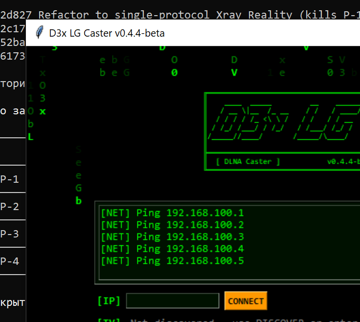

# CastToTV

DLNA video caster for LG webOS TVs and generic WiFi cast dongles, with
external subtitle support and on-the-fly audio transcoding.

Single-file Python app, keygen-2005-style Tk GUI (matrix rain + optional
chiptune), no installation required.



## Features

- **Discovery** — SSDP M-SEARCH, ICMP network sweep, or manual IP entry.
- **DLNA port auto-detection** — LG TVs randomise their AVTransport port
  after every reboot; the app fingerprints open ports until it finds one
  whose XML descriptor advertises `MediaRenderer` + `AVTransport`.
- **Built-in HTTP server with Range support** — seeking works during
  playback (`<<30s`, `<<10s`, `>>10s`, `>>30s`, `>>5m` controls).
- **External subtitles** — SRT, VTT, SUB, SMI delivered via the
  `CaptionInfo.sec` HTTP header and `sec:CaptionInfoEx` DIDL-Lite metadata.
  UTF-8 BOM is auto-prepended for LG decoder compatibility.
- **Audio transcode on demand** — AC3, EAC3, DTS, TrueHD, MLP audio is
  re-encoded to AAC stereo via ffmpeg pipe; video stream is copied
  losslessly. Triggered automatically when a track LG can't decode is
  detected.
- **WiFi cast dongle mode** — for Maxscreen / AnyCast / EZCast / ElfCast
  dongles, the app builds an MPEG-TS in a 50 MB ring buffer and serves
  it over `video/MP2T` with `transferMode.dlna.org: Streaming`. Seeking
  by re-spawning ffmpeg with `-ss`.
- **Dongle WiFi reconfigure** — one-click open of the dongle's setup web
  UI (`192.168.49.1`, `192.168.203.1`, etc.) to point it back at the
  home network after a reset.
- **Debug logger** — `cast_log.txt` next to the script, gated by
  `DEBUG_VERBOSE`. Logs every HTTP request, response code, DLNA header,
  and access line — handy for diagnosing TV-side rejection.

## Screenshots

| | |
|---|---|
| Initial state — banner, log box, IP entry | SSDP discovery — real LG TV detected |
|  |  |
| Cast in progress — seek bar | Dongle WiFi setup dialog |
| <!-- TODO: docs/images/cast.png — capture once a video is mid-cast --> | <!-- TODO: docs/images/dongle.png — click DONGLE WiFi to capture --> |

## Quick start

```bash
python cast_to_tv.py
```

1. Click `< DISCOVER >` (SSDP) or `< NET SCAN >` (ICMP sweep). On a
   reachable TV the IP populates automatically.
2. Click `[...]` to pick a video file.
3. (Optional) Click the `[...]` next to `[SUBS]` to attach a subtitle file.
4. Click `<<< CAST >>>`.

The TV starts playing within ~2 seconds. Use the seek buttons to jump.

## Build a Windows executable

```bat
pip install pyinstaller
build.bat
```

Output: `dist\CastToTV.exe` (single file, ~15 MB, UPX-compressed).

The PyInstaller spec is `CastToTV.spec` — a tagged push to GitHub also
triggers `.github/workflows/build.yml` which produces the same `.exe`
as a release artefact.

## Compatibility

Receivers tested:

| Device | Mode | Status |
|---|---|---|
| LG webOS UP7750 | DLNA AVTransport | ✅ Native, no transcode for H.264/AAC MP4/MKV |
| LG webOS (older, < 2018) | DLNA AVTransport | ✅ Often needs AC3/DTS → AAC transcode |
| Maxscreen / AnyCast / EZCast / ElfCast WiFi dongles | MPEG-TS over HTTP | ✅ Auto-switches to DongleCaster when detected |
| Samsung / Sony Bravia | DLNA AVTransport | Untested but should work — same UPnP profile |

Subtitles: only LG webOS implements `CaptionInfo.sec`. On other receivers
the `<sub>` track will be served but the renderer may ignore it.

## Requirements

- Python 3.10+ (`tkinter` ships with the standard distribution).
- `ffmpeg` / `ffprobe` on `PATH` for transcode + dongle MPEG-TS modes.
  Without ffmpeg the app falls back to direct file serving — works for
  H.264/AAC MP4/MKV but not for sources with AC3/DTS audio.
- Windows for the chiptune music (`winsound.Beep`); on other platforms
  the music button silently no-ops.
- LG webOS TV / DLNA renderer reachable on the LAN.

## Project layout

```
.
├── cast_to_tv.py           main app (Tk GUI + HTTP server + DLNA SOAP)
├── CastToTV.spec           PyInstaller spec
├── build.bat               one-shot Windows build
├── docs/
│   ├── images/             screenshots
│   ├── capture_screenshots.ps1   helper to launch GUI + grab window PNG
│   └── auto_capture.py     pyautogui colour-driven capture (best-effort)
├── legacy/                 January prototypes — pre-repo origin
│   ├── README.md
│   ├── dlna_cast.py        2025-12-31 — first SOAP cast
│   ├── cast_to_lg.py       2026-01-04 — added nmap port discovery
│   └── dlnap.py            cherezov/dlnap v0.15 (vendored MIT)
└── .github/workflows/      tag-driven exe build
```

The `legacy/` folder preserves the three hand-written scripts from the
weekend this project actually started; see [legacy/README.md](legacy/README.md)
for which design choices in `cast_to_tv.py` descend from each one.

## Roadmap

- [ ] Replace nothing — current SSDP discovery + manual IP cover all
      observed cases. (`legacy/cast_to_lg.py` used `nmap`; that's gone.)
- [ ] mDNS / Chromecast support (would need a different SOAP profile).
- [ ] Subtitle styling overrides (currently uses TV defaults).
- [ ] Headless mode for scripted casts (`--cast file.mp4 --to 192.168.x.y`).

## License

MIT — see [LICENSE](LICENSE).

`legacy/dlnap.py` is by Pavel Cherezov, MIT-licensed, copied verbatim
from [cherezov/dlnap](https://github.com/cherezov/dlnap).
