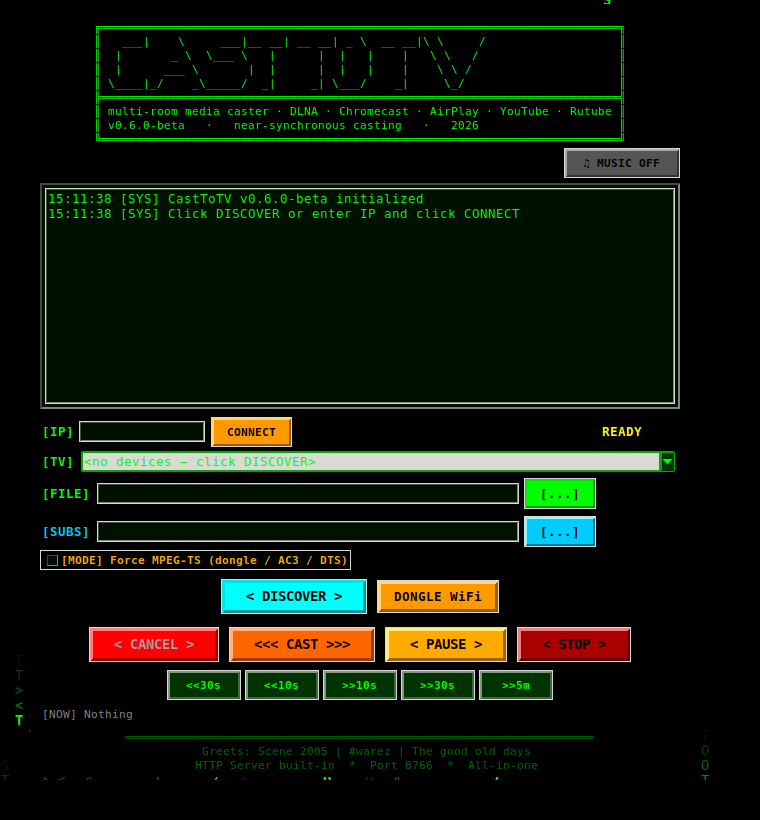
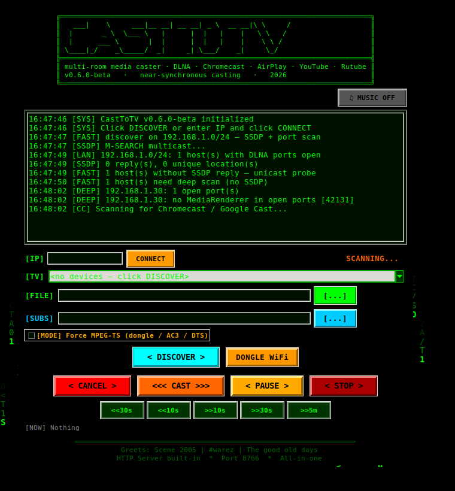
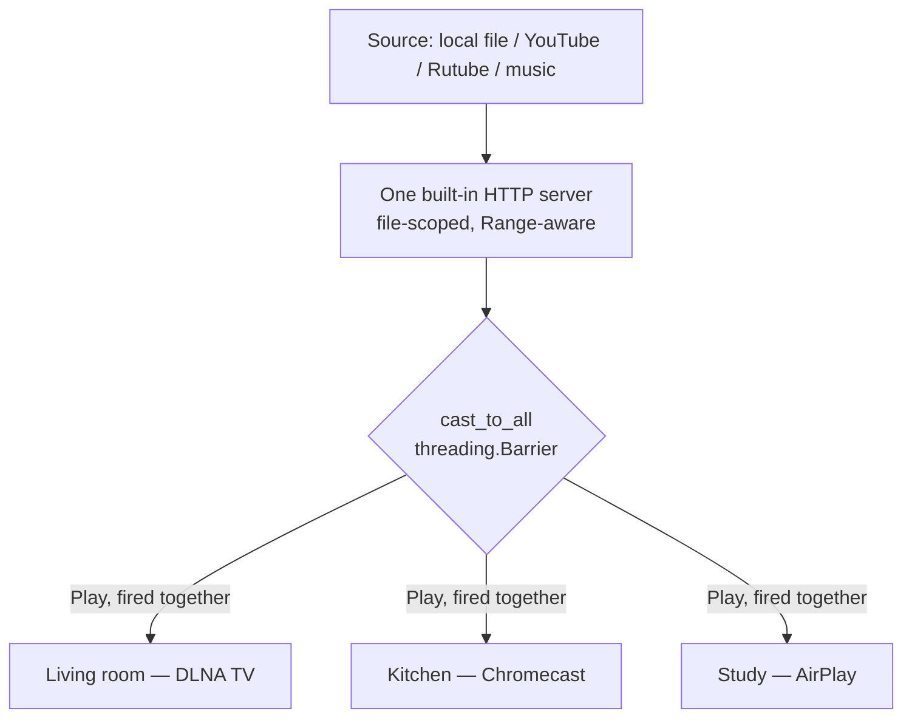
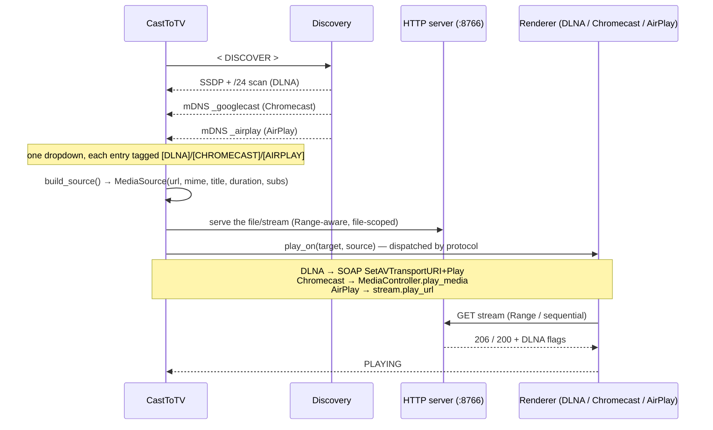
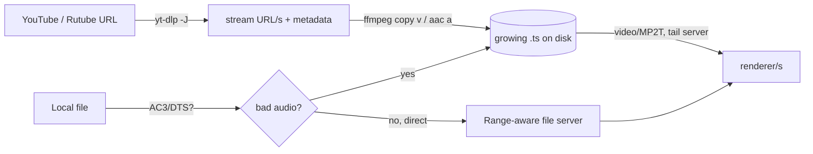

# CastToTV

```
╔════════════════════════════════════════════════════════╗
║   ___|    \     ___|__ __| __ __| _ \  __ __|\ \     / ║
║  |       _ \  \___ \   |      |  |   |    |   \ \   /  ║
║  |      ___ \       |  |      |  |   |    |    \ \ /   ║
║ \____|_/    _\_____/  _|     _| \___/    _|     \_/    ║
╠════════════════════════════════════════════════════════╣
║ multi-room media caster                                ║
║ DLNA · Chromecast · AirPlay · YouTube · Rutube         ║
║ v0.6.0-beta   ·   near-synchronous casting   ·   2026  ║
╚════════════════════════════════════════════════════════╝
```

> Cast a video, a YouTube/Rutube link, or music to **any** screen and
> speaker in your home — a DLNA TV, an HDMI dongle, a Chromecast, an
> Apple TV — and fan the **same** stream out to every room at once so you
> can walk around the house and keep hearing (and seeing) what's playing.
> One single-file Python app, keygen-2005 styling, ffmpeg + yt-dlp under
> the hood, no installation.

[](https://www.python.org/)
[]()
[](LICENSE)
[]()
[]()
[]()



*One `< DISCOVER >` sweeps DLNA (SSDP + /24 scan), Chromecast (mDNS) and
AirPlay (mDNS) and merges everything into one protocol-tagged dropdown:*



## What it does

CastToTV discovers every cast-capable device on your LAN — across **four
protocol families** — and lists them in one dropdown, each tagged with
how it's reached:

| Receiver | Protocol | Status |
|---|---|---|
| Smart TVs, HDMI WiFi dongles (AnyCast / EZCast / Maxscreen / ElfCast), LG webOS, Samsung, Sony | **DLNA / UPnP** | ✅ full |
| Chromecast, Google TV / Android TV, Nest displays, Chromecast audio groups | **Chromecast** | ✅ full |
| Apple TV, AirPlay receivers, AirPlay-capable dongles | **AirPlay** | ✅ play-URL |
| Phones / laptops that only mirror the screen | **Miracast** | ⚠️ system helper only — see below |

…and plays, to one device or to many at once:

- **Local files** in almost any format — H.264/HEVC, MKV/MP4, with
  on-the-fly AC3/DTS→AAC transcoding when the renderer is picky.
- **YouTube and Rutube** links (and anything else yt-dlp resolves) —
  paste the URL into the `[FILE]` field.
- **Music** — same pipeline, audio MIME.

## TL;DR

```bash
git clone https://github.com/mikhailartamonov/CastToTV.git && cd CastToTV

# Lite — DLNA + YouTube/Rutube only, just needs ffmpeg + yt-dlp on PATH:
python cast_to_tv.py

# Full — adds Chromecast + AirPlay (one-time venv with the extra deps):
python3 -m venv --system-site-packages .venv
.venv/bin/python -m pip install pychromecast pyatv
.venv/bin/python cast_to_tv.py
```

Click `< DISCOVER >`, pick a device (or several — see **Multi-room**),
choose a file or paste a link, click `<<< CAST >>>`. The screen starts
playing within a couple of seconds.

## Multi-room: walk-around playback

The headline feature. One source is built **once** and the same HTTP
stream is handed to every selected renderer near-simultaneously, so the
whole house plays in step (best-effort).


```mermaid
flowchart TB
    SRC[Source: local file / YouTube / Rutube / music]
    SRC --> HTTP[One built-in HTTP server<br/>file-scoped, Range-aware]
    HTTP --> BAR{cast_to_all<br/>threading.Barrier}
    BAR -->|Play, fired together| R1[Living room — DLNA TV]
    BAR -->|Play, fired together| R2[Kitchen — Chromecast]
    BAR -->|Play, fired together| R3[Study — AirPlay]
```

**Honest about sync.** A `threading.Barrier` makes every `Play` command
leave at the same instant, but each renderer has its own clock — expect a
few seconds of drift between independent devices. The one place sync is
*tight* is a **Chromecast speaker group**, which Google keeps in lock-step
internally; those show up as a single target. A best-effort *Re-sync*
nudges laggards with a coordinated seek. This is "hear the same thing in
every room", not frame-accurate video walls.

## How a single cast works


```mermaid
sequenceDiagram
    participant App as CastToTV
    participant Disc as Discovery
    participant HTTP as HTTP server (:8766)
    participant Dev as Renderer (DLNA / Chromecast / AirPlay)

    App->>Disc: < DISCOVER >
    Disc-->>App: SSDP + /24 scan  (DLNA)
    Disc-->>App: mDNS _googlecast  (Chromecast)
    Disc-->>App: mDNS _airplay     (AirPlay)
    Note over App: one dropdown, each entry tagged [DLNA]/[CHROMECAST]/[AIRPLAY]

    App->>App: build_source() → MediaSource(url, mime, title, duration, subs)
    App->>HTTP: serve the file/stream (Range-aware, file-scoped)
    App->>Dev: play_on(target, source) — dispatched by protocol
    Note over App,Dev: DLNA → SOAP SetAVTransportURI+Play<br/>Chromecast → MediaController.play_media<br/>AirPlay → stream.play_url
    Dev->>HTTP: GET stream (Range / sequential)
    HTTP-->>Dev: 206 / 200 + DLNA flags
    Dev-->>App: PLAYING
```

`MediaSource` decouples **where the bytes come from** from **which
protocol plays them**, and `play_on()` is the one dispatch point every
backend plugs into — so a new receiver type is a new branch, not a rewrite.

## Sources: files, YouTube, Rutube

Local files take the direct path (Range-aware HTTP, native TV-side seek)
unless the audio is AC3/EAC3/DTS/TrueHD/MLP — then ffmpeg copies the video
and re-encodes only the audio to AAC stereo. Extractable URLs go through a
single `yt-dlp -J` call (metadata **and** stream URLs at once), ffmpeg
muxes into a **growing MPEG-TS file on disk** (disk-bounded — no in-memory
buffer to OOM on a 3-hour video), and a tail HTTP server feeds every
renderer from that one file:


```mermaid
flowchart LR
    U[YouTube / Rutube URL] -->|yt-dlp -J| M[stream URL/s + metadata]
    M -->|ffmpeg copy v / aac a| TS[(growing .ts on disk)]
    TS -->|video/MP2T, tail server| R[renderer/s]
    L[Local file] -->|AC3/DTS?| Q{bad audio?}
    Q -->|yes| TS
    Q -->|no, direct| H[Range-aware file server]
    H --> R
```

For old WiFi dongles that can't seek, the legacy `DongleCaster` still
serves MPEG-TS streaming-mode (`DLNA.ORG_OP=00`, no Range).

## The DLNA / LG gotchas (kept, because they're real)

Streaming a local file to an LG webOS TV looks solved until you try. The
five quirks no one writes down — all handled automatically:

1. **The AVTransport port randomises after every reboot** — so discovery
   runs every session.
2. **SSDP multicast is silently dropped on many home LANs** (AP isolation,
   IGMP snooping, mesh) — hence the parallel /24 TCP scan and deep-scan
   fallback.
3. **External subtitles need `CaptionInfo.sec` _and_ `sec:CaptionInfoEx`**
   — both, matching case.
4. **Subtitles must start with a UTF-8 BOM** — auto-prepended.
5. **The DMR rejects long / non-ASCII URLs** with UPnP `716` — so the TV
   only ever sees an ASCII alias (`video.mkv`), with the real name kept in
   the DIDL `<dc:title>` overlay.

> The two newer protocols have their own catches: **Chromecast can't
> decode MPEG-TS**, so YouTube/dongle TS streams are refused with a clear
> message (cast a direct MP4 instead); **AirPlay** uses `play_url` (the
> receiver pulls the URL) and Apple TVs may need a one-time PIN pair; and
> **Miracast isn't an in-app stream at all** — it mirrors your whole
> screen over Wi-Fi Direct, so on Linux it's deferred to the system's
> *Network Displays* helper rather than driven from here.

## Case studies

### Case 1 — "Why does my movie play silent on the LG?"

H.264 + AC3. LG has no AC3 licence, so it plays the video and mutes the
audio with no error. `probe_file` catches the codec and routes through
ffmpeg `-c:v copy -c:a aac -b:a 128k -ac 2`; video stays bit-identical.

### Case 2 — "The cast dongle won't seek"

A $12 ElfCast drops the connection on any Range past byte 0. The fix is to
never let it ask: MPEG-TS (already a streaming format), served on one open
connection, no 206. That's `DongleCaster`.

### Case 3 — "SSDP says nothing, but the TV is right there"

Guest VLAN / client isolation / mesh that won't relay multicast. The /24
TCP scan finds the host; the deep-scan fallback brute-forces ~50 000 ports
in parallel and HTTP-probes each for `MediaRenderer` + `AVTransport`,
short-circuiting on the first hit (~15 s click-to-dropdown).

### Case 4 — "UPnP 716, but the URL works in my browser"

`Реквием по мечте (2000).mkv` → a 219-char `%D0…` URL the DMR rejects
before fetching. The TV only ever gets `video.mkv`; the HTTP server maps
the alias to the real path, and the Russian title still shows via DIDL.

## Standalone binaries

The goal is a self-contained download with **ffmpeg and yt-dlp bundled
inside** — no system dependencies — for:

- **Windows** — PyInstaller one-file `.exe`.
- **Ubuntu** (priority) — PyInstaller one-file, static ffmpeg + `yt-dlp`
  bundled; runs on a clean machine with nothing installed.
- **Arch Linux** — same one-file build, or a `PKGBUILD` using Arch's
  system `ffmpeg`/`yt-dlp`.

`resolve_binary()` finds bundled helpers (`sys._MEIPASS`) first and falls
back to `PATH`, so the *same* code powers both the fat bundle and a "lite"
install. *(Build scripts land with Phase 6 — see Roadmap.)*

## Requirements

- **Python 3.10+** — `tkinter` ships with the standard distribution.
- **ffmpeg / ffprobe** and **yt-dlp** — on `PATH` for the lite run, or
  bundled in the standalone binaries. Without ffmpeg the app still serves
  plain H.264/AAC files directly.
- **`pychromecast`, `pyatv`** — only for Chromecast / AirPlay (installed
  into a project `.venv`; the app runs DLNA-only without them).
- **Same `/24` as the receivers**, no client isolation.

## Project layout

```
.
├── cast_to_tv.py     main app: Tk GUI + HTTP server + DLNA/Chromecast/AirPlay
├── CastToTV.spec     PyInstaller spec
├── build.bat         Windows build
├── docs/images/      screenshots (Linux + Windows)
├── legacy/           January prototypes — pre-repo origin (vendored dlnap, MIT)
└── .github/workflows/ tag-driven builds
```

## Roadmap

- [x] Fast unified SSDP + /24 scan + deep-scan fallback, one click
- [x] Range-aware HTTP server, seek, pause/resume
- [x] AC3/DTS → AAC auto-transcode; dongle MPEG-TS mode
- [x] ASCII URL aliasing, UPnP `716`/`701` recovery, subtitle BOM
- [x] **Rebrand to CastToTV; cross-platform UI (Consolas → mono on Linux)**
- [x] **YouTube + Rutube via yt-dlp → ffmpeg → growing-file stream**
- [x] **`MediaSource` / `play_on` cast abstraction**
- [x] **Chromecast backend (pychromecast)**
- [x] **AirPlay backend (pyatv)**
- [x] **Multi-room `[MULTI]` cast — `cast_to_all` barrier, best-effort sync**
- [ ] Standalone bundled binaries (Windows / Ubuntu / Arch)
- [ ] Miracast helper integration
- [ ] [Stream from magnet / torrent](https://github.com/mikhailartamonov/CastToTV/issues/1)
- [ ] Headless / CLI mode

## License

[MIT](LICENSE) — do whatever, no warranty.

`legacy/dlnap.py` is by Pavel Cherezov, also MIT, copied verbatim from
[cherezov/dlnap](https://github.com/cherezov/dlnap).

---

<sub>Windows screenshots (the original `D3x`-era UI) are kept in
`docs/images/` for reference; the Linux build above is the current look.</sub>
</content>
