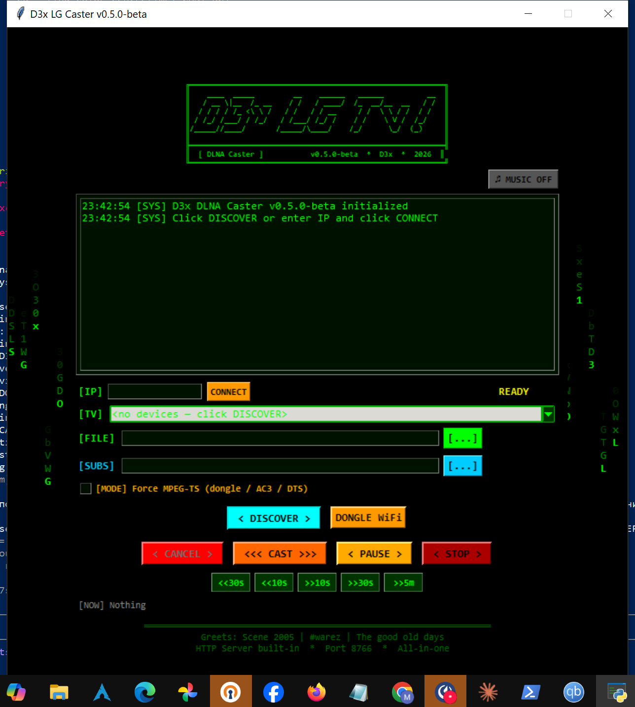
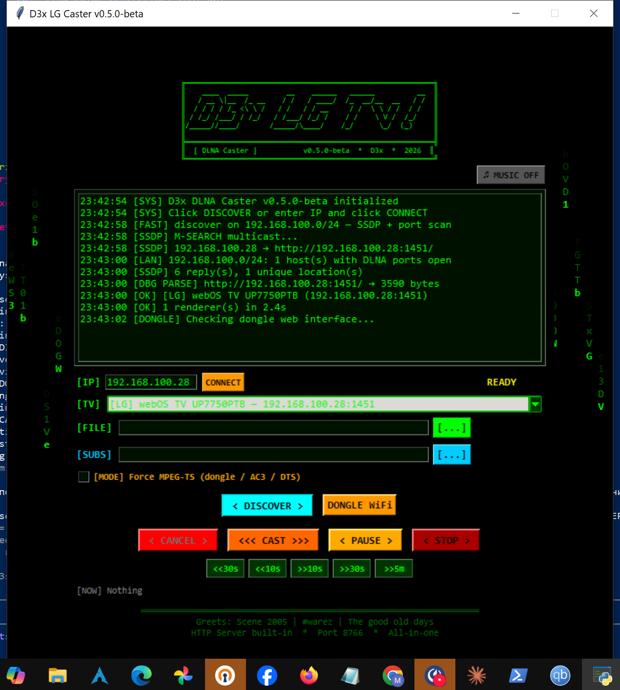
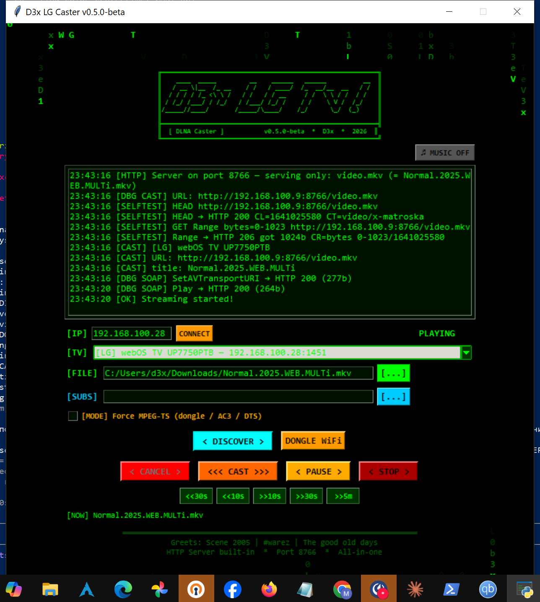
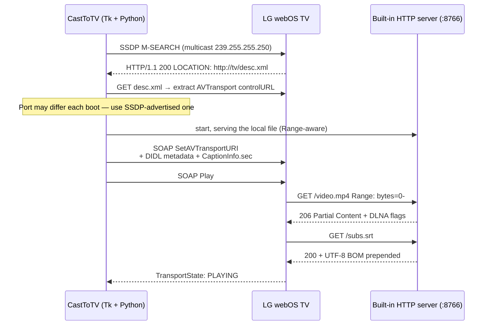
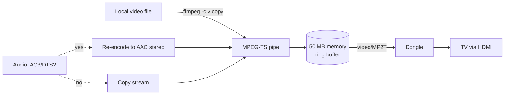

# CastToTV

```
╔═══════════════════════════════════════════════════════════╗
║    ____  _____         __    ______   ______          __  ║
║   / __ \|__  /_ __    / /   / ____/  /_  __/__  __   / /  ║
║  / / / / /_ <\ \ /   / /   / / __     / /  \ \ / /  / /   ║
║ / /_/ /___/ / /_/   / /___/ /_/ /    / /    \ V /  /_/    ║
║/_____//____/       /_____/\____/    /_/      \_/  (_)     ║
║                                                           ║
╠═══════════════════════════════════════════════════════════╣
║  [ DLNA Caster ]           v0.5.0-beta  *  D3x  *  2026  ║
╚═══════════════════════════════════════════════════════════╝
```

> A keygen-2005-styled DLNA caster for LG webOS TVs and generic WiFi
> cast dongles. Fast parallel SSDP+/24 discovery with deep port-scan
> fallback, on-the-fly AC3/DTS→AAC transcoding, external subtitles,
> pause/resume, single-file Python, ~1500 LOC, no installation.

[](https://www.python.org/)
[]()
[](LICENSE)
[]()
[]()


## Screenshots

| | |
|---|---|
| Initial state — `[TV]` dropdown, `[MODE]` checkbox, PAUSE button | Fast discovery — LG webOS UP7750 detected, IP synced, dropdown populated |
|  |  |
| `DONGLE WiFi` probe (mid-check of dongle gateway IPs) | Mid-cast — selftest HEAD/GET, `SetAVTransportURI 200`, `Play 200`, "Streaming started!" |
|  |  |

---

## TL;DR

```bash
git clone https://github.com/mikhailartamonov/CastToTV.git && cd CastToTV
python cast_to_tv.py
# Click DISCOVER → click [...] → pick a video → click <<< CAST >>>
```

The TV starts playing within ~2 seconds. That is the entire workflow.

## Why this exists

Streaming a local file to an LG webOS TV looks like a solved problem
until you actually try. VLC's renderer support hangs on subtitles. Plex
needs a server. Kodi wants a remote. Web casts re-encode the entire
file. Chrome's Cast extension only speaks Google's protocol.

DLNA / UPnP works on every TV in the last 15 years, but the spec is a
maze and LG's implementation has five quirks no one writes down:

1. **The AVTransport port randomises after every reboot** — port `9197`
   one day, `41123` the next. So discovery has to happen every session.
2. **SSDP multicast is silently dropped on many home LANs** (AP isolation,
   IGMP snooping, guest VLAN, mesh APs) — the TV is there, just unreachable
   via the polite discovery path. Most casters give up here.
3. **External subtitles need `CaptionInfo.sec` _plus_ `sec:CaptionInfoEx`**
   — both, in matching case, or the renderer ignores them.
4. **Subtitles must start with a UTF-8 BOM**, even though the spec
   doesn't require one. The decoder silently drops anything else.
5. **The DMR rejects long URLs with non-ASCII bytes or spaces** with
   UPnP `716 Resource not found` — before it even tries to fetch the URL.
   Filename `Реквием по мечте (2000).mkv` simply doesn't cast.

CastToTV figures all five out automatically. The GUI is the kind of
thing you used to find on a warez floppy — and that's the point.

## How casting works


```mermaid
sequenceDiagram
    participant App as CastToTV (Tk + Python)
    participant TV as LG webOS TV
    participant HTTP as Built-in HTTP server (:8766)

    App->>TV: SSDP M-SEARCH (multicast 239.255.255.250)
    TV-->>App: HTTP/1.1 200 LOCATION: http://tv/desc.xml
    App->>TV: GET desc.xml → extract AVTransport controlURL
    Note over App: Port may differ each boot — use SSDP-advertised one

    App->>HTTP: start, serving the local file (Range-aware)
    App->>TV: SOAP SetAVTransportURI<br/>+ DIDL metadata + CaptionInfo.sec
    App->>TV: SOAP Play
    TV->>HTTP: GET /video.mp4 Range: bytes=0-
    HTTP-->>TV: 206 Partial Content + DLNA flags
    TV->>HTTP: GET /subs.srt
    HTTP-->>TV: 200 + UTF-8 BOM prepended
    TV-->>App: TransportState: PLAYING
```

For WiFi cast dongles (Maxscreen / AnyCast / EZCast / ElfCast) the same
control plane is used, but the data plane switches to MPEG-TS in a 50 MB
ring buffer because dongles can't seek raw MP4:


```mermaid
flowchart LR
    A[Local video file] -->|ffmpeg -c:v copy| B[MPEG-TS pipe]
    B --> C[(50 MB memory<br/>ring buffer)]
    C -->|video/MP2T| D[Dongle]
    D --> E[TV via HDMI]
    F[Audio: AC3/DTS?] -.->|yes| G[Re-encode to AAC stereo]
    G --> B
    F -.->|no| H[Copy stream]
    H --> B
```

## Features

- **Fast unified discovery.** One `< DISCOVER >` button runs SSDP
  multicast and a parallel TCP scan of the entire `/24` on DLNA-relevant
  ports (~400 workers, ~2 s) **at the same time**, then dedupes by
  `(ip, port)`. Found device XMLs are fetched in parallel.
- **Deep port-scan fallback** for hosts that don't reply to SSDP at all
  (LG's DMR on some firmwares is mute on `1900/udp`). All 50 000 ports
  scanned with 800-way concurrency in ~13 s, then each open port HTTP-
  probed for `<MediaRenderer>` + `<AVTransport>`. Early-exit cancels the
  remaining probes the moment a hit lands.
- **Multi-device dropdown** — every renderer that came back via SSDP,
  port-scan or unicast lookup is listed in the `[TV]` combobox; pick one
  and the IP field syncs. Manual `CONNECT` adds to the same list with
  `(ip, port)` dedup.
- **File-scoped HTTP server.** The built-in server at `:8766` only
  serves the exact video + optional subtitle for the active cast — any
  other path is `404`. No directory listing, no other files leak.
- **ASCII URL aliasing.** Cyrillic, spaces, parens, `&`, long paths —
  none of that goes to the TV. URLs are normalised to `video.mkv` /
  `subs.srt`; the original filename only lives in the DIDL `<dc:title>`
  for the on-screen overlay. Fixes UPnP `716` on LG webOS.
- **UPnP errorCode-aware retry.** `_soap_call` parses
  `<errorCode>NNN</errorCode>` out of SOAP faults regardless of body
  length, so `cast_video` can auto-recover from `701 Transition not
  available` by sending `Stop` then re-issuing `SetAVTransportURI`.
- **Pause / Resume.** `< PAUSE >` button toggles `Pause` / `Play` SOAP
  actions; status label and button text reflect transport state.
- **Range-aware HTTP server** — seek buttons (`<<30s` / `>>10s` / `>>5m`)
  use DLNA `Seek` SOAP for native TV-side seeking; the server itself
  honours `Range: bytes=N-M` for direct-file mode.
- **External subtitles** — SRT, VTT, SUB, SMI. Delivered via
  `CaptionInfo.sec` HTTP header **and** `sec:CaptionInfoEx` DIDL-Lite
  metadata (with `sec:type` + `sec:URIType`), and the file is served
  with UTF-8 BOM auto-prepended.
- **On-the-fly audio transcode** — AC3 / EAC3 / DTS / TrueHD / MLP get
  re-encoded to AAC stereo via ffmpeg pipe; video is copied losslessly.
  Auto-engages when `probe_file` flags a bad codec, or via the explicit
  `[MODE] Force MPEG-TS` checkbox.
- **Dongle mode** — for WiFi cast sticks, MPEG-TS in a 50 MB memory
  ring buffer, served as `video/MP2T` with `transferMode.dlna.org:
  Streaming` and `DLNA.ORG_OP=00` (no Range). Seeking re-spawns ffmpeg
  with `-ss`.
- **Duration in DIDL** — TV remote shows the full timeline immediately
  instead of waiting on byte ranges to figure out the runtime.
- **Socket-clean teardown.** `HTTPServerThread.stop()` calls both
  `shutdown()` _and_ `server_close()` — without that, on Windows with
  `SO_REUSEADDR` a fresh server binds alongside the dead one and Windows
  hands incoming SYNs to either, causing random selftest timeouts on
  recasts. Took an evening to figure out.
- **One-click dongle WiFi reconfigure** — opens the dongle's setup web
  UI (`192.168.49.1`, `192.168.203.1`, `192.168.1.1`) when it forgets
  your network.
- **Debug logger** — `cast_log.txt` next to the script, gated by the
  `DEBUG_VERBOSE` flag, captures every request, response code, DLNA
  header, SOAP body and access line. Saved my evening more than once.

## Case studies

### Case 1 — "Why does my movie play silent on the LG?"

The MKV is H.264 video + AC3 5.1 audio. LG webOS doesn't have an AC3
licence, so the renderer accepts the file, plays the video, and mutes
the audio with no error.

CastToTV's `probe_file` reads the audio codec via ffprobe; if it's in
the bad-list (`ac3`, `eac3`, `dts`, `dca`, `truehd`, `mlp`) it routes
the file through ffmpeg with `-c:v copy -c:a aac -b:a 128k -ac 2` and
serves the resulting stream. The video is bit-for-bit identical, only
the audio is re-encoded, so CPU stays low.

```
[FFMPEG] audio ac3→AAC
[FFMPEG] Buffering...
[FFMPEG] Ready (50MB)
[HTTP] resp 206 bytes 0-65535/9217683456 ctype=video/MP2T
[OK] Playing on LG webOS TV UP7750PTB
```

### Case 2 — "The cast dongle won't seek"

You bought a $12 ElfCast off Aliexpress. It speaks DLNA but its
firmware drops the connection any time the TV requests a Range past
the first byte. So MP4 fast-start doesn't help — the dongle hangs the
moment you scrub.

The fix is to never let the dongle ask for a Range. Encode to MPEG-TS
(which is already a streaming format), keep the entire stream in a
50 MB ring buffer, and serve it back on a single open connection. When
the user clicks `>>10s`, ffmpeg restarts from the new offset and the
buffer resets.

That's the `DongleCaster` class. The dongle never sees a 206 response
and never has to seek.

### Case 3 — "SSDP says nothing, but the TV is right there"

You're on a guest VLAN, or your AP has client isolation, or your mesh
just doesn't relay multicast properly. You can `ping` the TV. The TV
is happily showing the YouTube screensaver. `< DISCOVER >` returns
zero devices, every time.

The targeted /24 TCP scan still finds the host (port `7000` is open on
LG webOS regardless of network state), but the SSDP follow-up to that
host on `1900/udp` also fails — the LG webOS DMR doesn't always reply
to unicast `M-SEARCH`. And worse: the AVTransport service randomises
its port across `1000–50000`, so no fixed list catches it.

The deep-scan fallback brute-forces all ~50 000 ports in parallel
(~13 s on a typical LAN at 800-way concurrency), HTTP-probes each open
port for the `MediaRenderer` + `AVTransport` device descriptor, and
short-circuits the moment one matches. Total time: ~15 s from click to
populated dropdown, with `<errorCode>` parsing for clean diagnostics
on the way.

```
[FAST] discover on 192.168.100.0/24 — SSDP + port scan
[LAN] 192.168.100.0/24: 1 host(s) with DLNA ports open
[SSDP] 0 reply(s), 0 unique location(s)
[FAST] 1 host(s) without SSDP reply — unicast probe
[FAST] 1 host(s) need deep scan (no SSDP)
[DEEP] 192.168.100.28: 16 open port(s)
[DEEP] 192.168.100.28:1451 → [LG] webOS TV UP7750PTB
[OK] 1 renderer(s) in 17.1s
```

### Case 4 — "UPnP 716, but the URL works in my browser"

Your filename is `Реквием по мечте - Requiem for a Dream (2000).mkv`.
The URL after `quote()` is 219 characters long with `%D0...%29` runs
and spaces. `Selftest HEAD → 200`. TV: `<errorCode>716</errorCode>
Resource not found` — and the TV never even sent a HEAD to your server.

LG's DMR validates the URL string before fetching. Long URLs, Cyrillic
bytes and parens trip it. The fix is to **only ever hand the TV an
ASCII alias** (`video.mkv`, `subs.srt`) and have the HTTP server map
that alias to the actual on-disk path. The Russian filename still
appears on the TV's overlay via `<dc:title>` in DIDL — only the URL is
sanitised.

## Quick start

```bash
python cast_to_tv.py
```

1. `< DISCOVER >` — SSDP + parallel /24 TCP scan + deep port-scan
   fallback, all in one click. Found renderers populate the `[TV]`
   dropdown. (Or paste an IP and `CONNECT` for a single host.)
2. `[...]` next to `[FILE]` — pick a video.
3. `[...]` next to `[SUBS]` — optional, attach a subtitle.
4. `[MODE] Force MPEG-TS` — optional, tick if you're casting to a
   dongle or know your audio is AC3/DTS. (Auto-engaged on bad-codec
   detect anyway.)
5. `<<< CAST >>>`. Use `< PAUSE >` / `< STOP >` for transport control;
   the seek bar (`<<30s` / `<<10s` / `>>10s` / `>>30s` / `>>5m`) works
   during playback.

## Build a Windows executable

```bat
pip install pyinstaller
build.bat
```

Output: `dist\CastToTV.exe` — single file, ~15 MB, UPX-compressed,
no Python required on the target machine.

A tagged push to GitHub also runs `.github/workflows/build.yml` which
attaches the same `.exe` to a release.

## Compatibility

| Receiver | Mode | Notes |
|---|---|---|
| LG webOS UP7750 (tested) | DLNA AVTransport | H.264/AAC plays without transcode. AC3/DTS audio auto-recodes. |
| LG webOS, older models | DLNA AVTransport | Same behaviour. Subtitle BOM trick is mandatory. |
| Maxscreen / AnyCast / EZCast / ElfCast dongles | MPEG-TS over HTTP | Auto-switches to `DongleCaster` ring buffer on detect. |
| Samsung / Sony Bravia | DLNA AVTransport | Untested, same UPnP profile so should work. |
| Chromecast | (not supported) | Different protocol stack — out of scope. |

## Requirements

- **Python 3.10+** — `tkinter` ships with the standard distribution.
- **ffmpeg / ffprobe** on `PATH` — required for transcode and dongle
  modes. Without them the app falls back to direct file serving (works
  for plain H.264/AAC, fails for AC3/DTS sources).
- **Network reachability to the TV** — same `/24`, no isolation
  between WiFi clients.
- **Windows** for the chiptune music (`winsound.Beep`); on Linux/macOS
  the music button silently no-ops.

## Project layout

```
.
├── cast_to_tv.py           main app: Tk GUI + HTTP server + DLNA SOAP
├── CastToTV.spec           PyInstaller spec
├── build.bat               one-shot Windows build
├── docs/
│   ├── images/             screenshots
│   ├── capture_screenshots.ps1  helper: launch GUI + grab window PNG
│   ├── interactive_capture.ps1  helper: timed capture for click flows
│   └── auto_capture.py     pyautogui colour-driven capture (best-effort)
├── legacy/                 January prototypes — pre-repo origin
│   ├── README.md
│   ├── dlna_cast.py        2025-12-31 — first SOAP cast
│   ├── cast_to_lg.py       2026-01-04 — added nmap port discovery
│   └── dlnap.py            cherezov/dlnap v0.15 (vendored, MIT)
└── .github/workflows/      tag-driven .exe build
```

The [`legacy/`](legacy/) folder preserves the three hand-written scripts
from the New Year's weekend the project actually started. See its own
[README](legacy/README.md) for which design choices in `cast_to_tv.py`
descend from each one.

## Roadmap

- [x] SSDP discovery (replaced January's `nmap` port-scan trick)
- [x] Range-aware HTTP server with seek
- [x] AC3/DTS → AAC auto-transcode
- [x] WiFi cast dongle MPEG-TS mode
- [x] Dongle WiFi reconfigure shortcut
- [x] File-based debug logger
- [x] Fast parallel SSDP + /24 TCP scan unified into one click (`v0.5.0`)
- [x] Deep port-scan fallback for SSDP-dead LANs / LG ephemeral port (`v0.5.0`)
- [x] Multi-device dropdown (`v0.5.0`)
- [x] File-scoped HTTP server — no directory listing (`v0.5.0`)
- [x] ASCII URL aliasing — Cyrillic/spaces/parens stop tripping `716` (`v0.5.0`)
- [x] UPnP errorCode-aware retry on `701 Transition not available` (`v0.5.0`)
- [x] Pause / Resume button (`v0.5.0`)
- [ ] Headless / CLI mode (`--cast file.mp4 --to 192.168.x.y`)
- [ ] Subtitle styling overrides (currently TV defaults)
- [ ] Chromecast — separate protocol stack, may never happen

## License

[MIT](LICENSE) — do whatever, no warranty.

`legacy/dlnap.py` is by Pavel Cherezov, also MIT-licensed, copied
verbatim from [cherezov/dlnap](https://github.com/cherezov/dlnap).

---

<sub>If you fix something here that helped you, drop a PR — even a
typo. The project is small enough that it's still a single afternoon
to read end-to-end.</sub>
